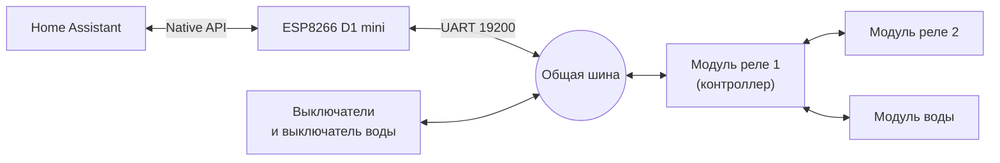
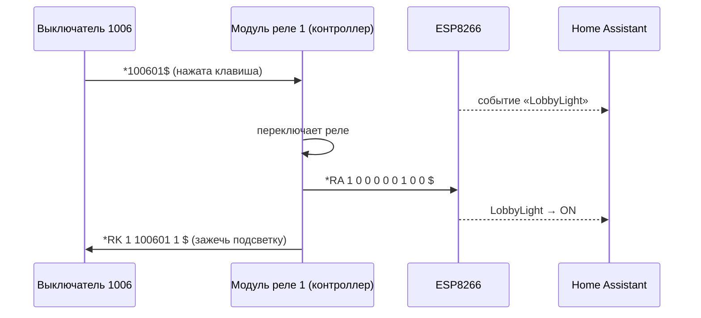
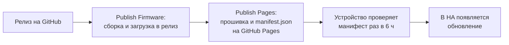

# ESPHome Gauhartas 204

[](https://github.com/vaninanton/esphome-gauhartas204/actions/workflows/ci.yml)
[](https://github.com/vaninanton/esphome-gauhartas204/releases)
[](https://esphome.io)
[](https://www.wemos.cc/en/latest/d1/d1_mini.html)

Прошивка [ESPHome](https://esphome.io) для шлюза между **Home Assistant** и самодельной системой умного дома в квартире. ESP8266 подключается к шине контроллера, управляет светом и водяным клапаном, получает обратную связь и передаёт в HA нажатия физических выключателей.

> [!NOTE]
> Система умного дома самодельная: у контроллера и выключателей нет маркировки и документации. Протокол восстановлен по программе со старой Raspberry Pi, которая раньше управляла системой, и по записям трафика на шине. Подробнее — в разделах [«История»](#история) и [«Что ещё не известно»](#что-ещё-не-известно).

## Содержание

- [Возможности](#возможности)
- [Как это устроено](#как-это-устроено)
- [Быстрый старт](#быстрый-старт)
- [Что появится в Home Assistant](#что-появится-в-home-assistant)
- [Автоматизации](#автоматизации)
- [Протокол шины](#протокол-шины)
- [Обновления по воздуху](#обновления-по-воздуху)
- [Разработка](#разработка)
- [Безопасность](#безопасность)
- [Датчик протечки](#датчик-протечки)
- [История](#история)
- [Что ещё не известно](#что-ещё-не-известно)

## Возможности

| | |
| --- | --- |
| 💡 **Свет** | 13 групп света в 8 комнатах. Состояние обновляется сразу, даже если свет переключили физическим выключателем |
| 🚰 **Вода** | Открытие и закрытие клапана, состояние «открыт / закрыт», закрытие по тревоге протечки |
| 🔘 **Выключатели** | Каждое нажатие клавиши, короткое и долгое, приходит в HA как событие, на него можно повесить автоматизацию |
| ✨ **Подсветка клавиш** | Действие HA зажигает и гасит подсветку любых клавиш на выключателях |
| 🩺 **Диагностика** | Датчик «Контроллер отвечает», последние строки с шины, неизвестные пакеты |
| ⬆️ **Обновления** | OTA из ESPHome Dashboard и HA, а также автоматически из GitHub Releases |
| 🌐 **Веб-интерфейс** | Встроенная страница управления на порту 80 |
| 📶 **Запасная точка доступа** | Без Wi‑Fi устройство поднимает точку доступа с captive portal для настройки сети |

## Как это устроено



Роль контроллера играет **модуль реле 1**: в него приходит на один провод больше, чем в модуль 2, и к нему подключены модуль реле 2 и модуль воды. Модуль 1 разбирает команды и нажатия, переключает свои реле, через модуль 2 — его реле, и отвечает за оба модуля (`*RA 1`, `*RA 2`) и за воду (`*RK WM …`).

Выключатели, выключатель воды, модуль 1 и ESP сидят на **одной шине** и слышат друг друга: ESP видит не только ответы контроллера, но и нажатия выключателей и команды подсветки. Физически шина, вероятно, RS-485.

Так выглядит нажатие выключателя в прихожей (записано с живой шины):



### Железо

| Параметр | Значение |
| --- | --- |
| Плата | ESP8266, Wemos D1 mini |
| UART TX / RX | GPIO1 / GPIO3 (аппаратный UART0) |
| Скорость | 19200 бод, 8N1 |
| Светодиод статуса | D4, инвертирован |
| Логи | Только по сети: UART0 занят шиной (`logger.baud_rate: 0`) |

## Быстрый старт

### Через ESPHome Dashboard

1. **Add device** → **Import from GitHub**.
2. Укажите `github://vaninanton/esphome-gauhartas204/esphome-gauhartas204-esp8266.yaml@main`.
3. Соберите и залейте прошивку.

### Из браузера

На [странице проекта](https://vaninanton.github.io/esphome-gauhartas204/) есть кнопка установки последнего релиза по USB (Chrome или Edge на компьютере).

### Вручную

```bash
git clone https://github.com/vaninanton/esphome-gauhartas204.git
cd esphome-gauhartas204
esphome run esphome-gauhartas204-esp8266.yaml                    # по USB
esphome run esphome-gauhartas204-esp8266.yaml --device <IP>      # по сети
```

После первой прошивки устройство поднимет точку доступа для настройки Wi‑Fi.

## Что появится в Home Assistant

Сущности разложены по устройствам-комнатам, каждая комната привязана к своей зоне.

### Свет

| Комната | Сущность | Реле |
| --- | --- | --- |
| Ванная | `BathroomLight` · `BathroomSubLight` (подсветка пола) | 1/1 · 1/7 |
| Холл ванной | `BathroomHall` | 1/2 |
| Кухня | `KitchenLight` · `KitchenTable` | 1/3 · 1/4 |
| Прихожая | `LobbyLight` | 1/5 |
| Гостиная | `LivingroomLight` · `LivingroomSubLight` | 2/6 · 1/6 |
| Спальня | `SleepingroomLight` · `SleepingroomLeft` · `SleepingroomRight` | 2/3 · 2/5 · 2/1 |
| Гардеробная | `SleepingroomWardrobe` | 2/7 |
| Балкон | `BalconyLight` | 2/2 |

«Реле» — это модуль и порт. У `SleepingroomRight` (правый бра) физической клавиши нет, им можно управлять только из HA.

### Вода

- **`water`** (Ванная) — клапан: открыть / закрыть, состояние по ответу контроллера.
- **«Выключатель воды»** (Ванная) — событие `ON` / `OFF` при нажатии физических клавиш.

### Выключатели

По одному событию (`event`) на каждый физический выключатель: «Выключатель 1000» … «Выключатель 1010», каждый в своей комнате. Тип события при коротком нажатии — что переключает клавиша, при долгом — `UpperLong` или `LowerLong`. Полная таблица — в разделе [«Коды клавиш»](#коды-клавиш).

### Управление и диагностика

| Сущность | Назначение |
| --- | --- |
| «Выключить всё» | Выключает весь свет, как мастер-клавиша |
| «Подсветка: включить всё» / «выключить всё» | Подсветка всех клавиш на всех выключателях |
| `wm_alr` | Сигнал тревоги протечки: вода перекрывается |
| `wm_reb` | Команда `*WM REB$` модулю воды — вероятно, перезагрузка (reboot) |
| «Проверить обновление» / «Установить обновление» | Запрос манифеста с GitHub Pages и установка релиза, не дожидаясь проверки раз в 6 ч |
| «Restart ESPHOME» | Перезагрузка ESP |
| «UART команда» | Отправка произвольной строки в шину (для исследования протокола) |
| «Контроллер отвечает» | `ON`, если контроллер отвечал в последние 5 минут |
| `latestSerial` | Последняя строка с шины, любая |
| `latestSerialUnknown` | Последняя строка, которую прошивка не разобрала |
| «Состояние модуля воды» (Ванная) | `ON`, `OFF`, `ALR` (протечка), `WSD` (нет связи с датчиком), `LOW` (батарейка) |
| «Обновление с GitHub Release» | Доступная версия прошивки |
| «Wi‑Fi сигнал», «Uptime», «ESPHome Version» | Состояние самого ESP |

## Автоматизации

### Реакция на нажатие клавиши

Контроллер сам переключает свет по нажатию. Событие позволяет добавить что-то своё, например по мастер-клавише в прихожей закрыть шторы. Триггер — любое изменение сущности (время последнего нажатия), а тип клавиши проверяется условием: так срабатывает и повторное нажатие той же клавиши.

```yaml
triggers:
  - trigger: state
    entity_id: event.vykliuchatel_1006   # «Выключатель 1006», проверьте ID в HA
    not_from: unavailable
conditions:
  - condition: state
    entity_id: event.vykliuchatel_1006
    attribute: event_type
    state: MasterOff
actions:
  - action: cover.close_cover
    target:
      entity_id: cover.gostinaia
```

Свободны для своих сценариев:

- **двойные нажатия** (`UpperDouble`, `LowerDouble`) на любом выключателе — свет от них не переключается;
- **долгое нажатие верхней клавиши** (`UpperLong`) на любом выключателе;
- **долгое нажатие нижней** (`LowerLong`) везде, кроме выключателя 1002 у кровати, где оно выключает весь свет;
- клавиша `100304` («Выключатель 1003», тип `Key04`) — переключает пустой порт.

Итого на каждом из десяти выключателей есть по 4–5 свободных жестов.

### Подсветка клавиш

```yaml
action: esphome.esphome_gauhartas204_set_backlight
data:
  codes: ["100701", "100704"]   # коды клавиш из таблицы ниже
  state: true                   # true — зажечь, false — погасить
```

> [!TIP]
> Контроллер сам перезаписывает подсветку клавиши, когда переключает связанное с ней реле. Если подсветка должна держаться, повторяйте действие по событию этой клавиши.

Кнопки «Подсветка: включить всё» и «выключить всё» (устройство «Управление») вызывают тот же скрипт с пустым списком кодов — это значит «вся квартира»: обе клавиши выключателей 1000–1010 без отсутствующего 1004 и индикатор `100206`, 21 кадр одной строкой.

- **Выключатель балкона (1008)** не подсвечивается вообще — ни от ESP, ни от самого контроллера: видимо, у него нет подсветки или она неисправна.
- **Выключатель воды** в «включить всё» не входит: её индикаторы показывают статус клапана, который шлёт контроллер (см. ниже).

### Индикаторы выключателя воды

Выключатель воды по форме такой же, как остальные, но подсветка клавиш у него синяя и красная вместо белой, и внутри есть пищалка. Он слушает статус `*RK WM <состояние>$` и показывает его сам; клапан на этот кадр не реагирует (проверено ложными статусами с ESP):

| Статус | Выключатель воды |
| --- | --- |
| `*RK WM ON$` | горит верхний индикатор (открыто) |
| `*RK WM OFF$` | горит нижний индикатор (закрыто) |
| `*RK WM ALR$` | **пищит раз в секунду и мигает нижний** (тревога протечки) |
| `*RK WM LOW$` | видимой реакции нет; вероятно, это статус «садится батарейка датчика протечки» |
| `*RK WM WSD$` | мигает верхний индикатор (режим WSD) |

Любое из этих состояний видно в HA в сенсоре **«Состояние модуля воды»** (`ON`, `OFF`, `ALR`, `WSD`, `LOW`) — на него можно вешать автоматизации, например уведомление о протечке.

Ложный статус держится до следующего настоящего ответа контроллера — например, до ближайшего опроса `*WM INF$` (не позже чем через 2 минуты).

## Протокол шины

Текстовый ASCII-протокол без контрольных сумм. Кадр начинается с `*` и заканчивается `$`, поля разделены пробелами, строка завершается `\r\n`. Выключатели разбирают поток по `*` и `$`, поэтому несколько кадров можно отправить одной строкой: `*RK 1 100201 1 $*RK 1 100701 1 $` (несколько кодов внутри одного кадра — нельзя). Самая длинная строка — около 25 символов, компонент читает до 30.

### Команды ESP → контроллер

| Назначение | Команда |
| --- | --- |
| Включить / выключить реле | `*<модуль> PRT <порт> <1\|0> $` — например `*1 PRT 5 1 $` |
| Запросить состояние реле | `*1 STS$`, `*2 STS$` |
| Открыть / закрыть воду | `*WM ON$` / `*WM OFF$` |
| Тревога протечки | `*WM ALR$` |
| Запросить состояние воды | `*WM INF$` |
| Выключить всё | `*999998$` |
| Перезагрузить модуль воды | `*WM REB$` — модуль отвечает статусом, видимых признаков нет |
| Включить режим WSD | `*WM WSD$` — выход из режима по `*WM ON$` (см. ниже) |

Каждые 120 с (и через 3 с после загрузки) ESP опрашивает контроллер: `*1 STS$` → 3 с → `*2 STS$` → 3 с → `*WM INF$`.

### Контроллер → ESP

| Пакет | Пример | Значение |
| --- | --- | --- |
| Состояние реле | `*RA 1 0 0 0 0 0 1 0 0 $` | Модуль и 8 значений p0…p7; порт N лежит в позиции `6 + 2·N` строки |
| Состояние воды | `*RK WM ON$` | `ON` — открыт; `OFF`, `ALR` — закрыт; прочие состояние не меняют |
| Подсветка клавиши | `*RK 1 100601 1 $` | Зажечь (1) или погасить (0) подсветку клавиши |
| Режим WSD | `*RK WM WSD$` | Модуль воды в режиме WSD; приходит и в ответ на `*WM INF$` |

### Выключатели → контроллер

| Пакет | Пример | Значение |
| --- | --- | --- |
| Нажатие клавиши | `*100601$` | Код `10XXYY`: `XX` — номер выключателя, `YY` — клавиша и тип нажатия: короткое, двойное или долгое (см. ниже) |
| Нажатие на выключателе воды | `*WM OFF$` | Те же команды, что шлёт ESP |

Выключатели **слушают шину сами**: если ESP отправит `*RK <любой модуль> <код> <1|0> $`, подсветка клавиши переключится. Номер модуля выключателю не важен.

### Коды клавиш

Последние две цифры кода — клавиша и тип нажатия:

| `YY` | Нажатие | Событие |
| --- | --- | --- |
| `01` | короткое, верхняя клавиша | что переключает клавиша |
| `04` | короткое, нижняя клавиша | что переключает клавиша |
| `02` | двойное, верхняя | `UpperDouble` |
| `05` | двойное, нижняя | `LowerDouble` |
| `03` | долгое (3–4 с), верхняя | `UpperLong` |
| `06` | долгое, нижняя | `LowerLong` |

Свет переключают только короткие нажатия (и `06` у выключателей у кровати — выключает всё). Двойные и долгие нажатия контроллер игнорирует, поэтому все они свободны для автоматизаций HA.

Реакция контроллера на короткие нажатия — в таблице ниже. Долгие нажатия всех выключателей 1000–1010 проверены эмуляцией: контроллер реагирует только на `100206` и `100406` (выключатели у кровати) — выключает весь свет. Остальные `…03` и `…06` он игнорирует.

| Код | Выключатель | Комната | Клавиша | Что делает |
| --- | --- | --- | --- | --- |
| `100001` | 1000 | Холл ванной | верхняя | SleepingroomWardrobe |
| `100004` | 1000 | Холл ванной | нижняя | SleepingroomWardrobe (тип события `SleepingroomWardrobeLower`) |
| `100101` | 1001 | Кухня | верхняя | KitchenTable |
| `100104` | 1001 | Кухня | нижняя | KitchenLight |
| `100201` | 1002 | Спальня | верхняя | SleepingroomLight |
| `100204` | 1002 | Спальня | нижняя | SleepingroomLeft |
| `100301` | 1003 | Холл ванной | верхняя | BathroomHall |
| `100304` | 1003 | Холл ванной | нижняя | `Key04` — пустой порт 0 модуля 1 |
| `100401` | 1004 | — | верхняя | SleepingroomLight — выключателя физически нет, см. ниже |
| `100404` | 1004 | — | нижняя | SleepingroomRight — выключателя физически нет, см. ниже |
| `100501` | 1005 | Ванная | верхняя | BathroomLight |
| `100504` | 1005 | Ванная | нижняя | BathroomSubLight — подсветка пола |
| `100601` | 1006 | Прихожая | верхняя | LobbyLight |
| `100604` | 1006 | Прихожая | нижняя | `MasterOff` — выключает весь свет |
| `100701` | 1007 | Спальня | верхняя | SleepingroomLight |
| `100704` | 1007 | Спальня | нижняя | LivingroomLight |
| `100801` | 1008 | Балкон | верхняя | BalconyLight |
| `100804` | 1008 | Балкон | нижняя | BalconyLight (тип события `BalconyLightLower`) |
| `100901` | 1009 | Гостиная | верхняя | LivingroomLight |
| `100904` | 1009 | Гостиная | нижняя | LivingroomSubLight |
| `101001` | 1010 | Гардеробная | верхняя | SleepingroomWardrobe |
| `101004` | 1010 | Гардеробная | нижняя | SleepingroomWardrobe (тип события `SleepingroomWardrobeLower`) |

**Выключатель 1004** в квартире отсутствует, но в контроллере по-прежнему настроен: если отправить в шину `*100401$`, `*100404$` или `*100406$` (поле «UART команда»), контроллер переключит основной свет спальни, правый бра или выключит весь свет. Видимо, это был выключатель у правой стороны кровати.

**Подсветка `100206`, `100406` и `100604`** — индикаторы «выключить всё» на выключателях у кровати и в прихожей: контроллер зажигает их, пока включён хоть какой-то свет.

Там, где обе клавиши переключают один и тот же свет, у нижней свой тип события с суффиксом `Lower`, чтобы автоматизации могли их различать.

Незнакомый код попадает в `latestSerialUnknown` с предупреждением в логе — так в этом проекте и нашлись двойные нажатия и недостающие клавиши. Чтобы добавить клавишу, допишите строку в таблицу `switches` в лямбде `on_value` и тип события в соответствующий `event`.

## Обновления по воздуху



**Publish Pages** кладёт файлы релиза в `firmware/`, а из манифеста релиза строит корневой `manifest.json` с путями относительно корня — его читают и устройства (OTA), и кнопка установки на странице.

На ESP8266 буфер приёма TLS по умолчанию 512 байт, и ответ больше одной записи не читается («Stream pointer vanished»). Поэтому в конфиге стоит `tls_buffer_size_rx: 4096`, а в манифесте укорочено поле `summary` — иначе туда попадает весь текст релиза.

> [!IMPORTANT]
> Устройство **проверяет** обновления само, но **скачать** прошивку по HTTPS не может: для её TLS-записей нужен буфер 16 КБ, а столько свободной памяти на ESP8266 нет. Проверено: с буфером 16 КБ не хватает памяти даже на манифест, с 8 КБ загрузка обрывается в самом начале, и отключение `web_server` (минус 29 КБ флеша) картину не меняет. Поэтому обновление ставится через ESPHome Dashboard или `esphome run`. Самообновление возможно, если раздавать манифест и прошивку по обычному HTTP из локальной сети (например, из папки `www` в Home Assistant) и отключить TLS через `esp8266_disable_ssl_support`.

Версия прошивки берётся из тега релиза. При локальной сборке версия `dev`, поэтому HA будет предлагать обновление до последнего релиза. Установка такого обновления вернёт прошивку из релиза.

## Разработка

```
├── esphome-gauhartas204-esp8266.yaml   # вся конфигурация и разбор протокола
├── components/uart_read_line/          # компонент: построчное чтение UART
├── static/                             # страница проекта на GitHub Pages
└── .github/workflows/
    ├── ci.yml                          # сборка на stable, ночью ещё и beta
    ├── publish-firmware.yml            # сборка релиза
    └── publish-pages.yml               # Pages + OTA-манифест
```

**`uart_read_line`** — маленький внешний компонент. Он читает строки до `\r` или `\n` (до 30 символов, длинные обрезает с предупреждением) и публикует каждую непустую строку в text_sensor. Весь разбор протокола сделан в YAML, в лямбде `on_value`.

**CI** собирает прошивку при пуше в `main` и в пулл-реквестах на `stable` (на ней же собираются релизы). В ночном прогоне добавляется `beta`, чтобы заранее увидеть поломки со следующей версией ESPHome и не удваивать сборку на каждый PR.

Для локальной сборки нужен [ESPHome](https://esphome.io/guides/installing_esphome/). Логи смотрятся по сети: `esphome logs esphome-gauhartas204-esp8266.yaml --device <IP>`. ESP8266 может терять строки лога при всплеске сообщений, поток `/events` веб-сервера надёжнее.

## Безопасность

Конфигурация рассчитана на доверенную домашнюю сеть:

- API работает **без шифрования**, OTA **без пароля**;
- веб-сервер на порту 80 без авторизации и позволяет загрузить прошивку;
- запасная точка доступа **открыта**;
- обновления с GitHub скачиваются без проверки сертификата (ограничение ESP8266), целостность проверяется по MD5.

Любой, кто попал в локальную сеть или к точке доступа, может управлять светом и водой. Секреты сюда не добавлены намеренно: прошивка релизов публичная, и всё, что в неё вшито, видно всем.

## Датчик протечки

Проводных датчиков протечки в системе нет. Протечку сторожит **Zigbee-датчик Xiaomi**, который работал через свой шлюз: сервис на Raspberry Pi опрашивал облако Xiaomi и сообщал состояние датчика модулю воды отдельными командами. Этим объясняются команды, которые иначе выглядят странно:

| Команда | Событие у датчика | Реакция системы |
| --- | --- | --- |
| `*WM ALR$` | протечка | вода перекрывается, выключатель воды пищит и мигает нижним индикатором |
| `*WM WSD$` | нет связи с датчиком | мигает верхний индикатор, вода остаётся открытой |
| `*RK WM LOW$` | садится батарейка | видимой реакции не нашли |
| `*WM ON$` | всё в порядке | обычное состояние, выход из режима `WSD` |

Связку с облаком Xiaomi заменил Home Assistant: датчик живёт в нём, а прошивка **сама подписывается** на его состояние через API и при протечке отправляет модулю воды тревогу. Текущее значение видно в сущности «Датчик протечки (из HA)» (зона «Ванная»).

```yaml
binary_sensor:
  - platform: homeassistant
    entity_id: binary_sensor.wleak_kitchen_leak
    internal: false        # у этой платформы по умолчанию true
    on_press:
      - script.execute: { id: send_water_sensor_state, state: alarm }
```

Намеренно не отправляются: «нет связи» (`*WM WSD$`) и «садится батарейка» (`*RK WM LOW$`) — они ничего не защищают, а первое ещё и оставляет мигающий индикатор. Возврат в норму тоже не отправляется автоматически.

Те же команды можно послать вручную — из автоматизации или кнопкой:

```yaml
action: esphome.esphome_gauhartas204_set_water_sensor_state
data:
  state: alarm        # ok | alarm | offline | low_battery
```

> [!WARNING]
> После тревоги контроллер держит воду перекрытой, пока не получит `*WM ON$` (состояние `ok` или кнопка «открыть» у клапана). Это же состояние — единственный известный выход из режима `offline`. Учтите, что `ok` открывает клапан.

> [!CAUTION]
> Если на датчик в HA повешены уведомления, тестовая подмена его состояния поднимет настоящую тревогу на телефонах. Проверено на себе.

## История

Раньше системой управляла **Raspberry Pi** первого или второго поколения с самодельной платой поверх. Судя по всему, плата была конвертером RS-485 ↔ UART. Протокол взят из программы на этой «малинке» и дополнен записями трафика с живой шины: так нашлись коды клавиш, команды подсветки и мастер-клавиша.

На известные стандарты (Modbus, KNX, DALI) протокол не похож, публичной документации найти не удалось. Скорее всего, его написал интегратор, который ставил систему.

## Что ещё не известно

- Что именно значит `*WM WSD$` — вероятно, «датчик протечки недоступен» (Water Sensor Disconnected). Проверено: это устойчивый режим, а не разовое действие — верхний индикатор выключателя воды мигает, контроллер отвечает `*RK WM WSD$` даже на `*WM INF$`, вода остаётся открытой. Повторная `*WM WSD$` из режима не выводит, выводит `*WM ON$`. Состояние клапана прошивка в этом режиме не меняет.
- `*WM REB$` — судя по названию, перезагрузка модуля воды; проверкой не подтверждено.
- `*RK WM LOW$` — предположительно, «садится батарейка датчика протечки». Видимой реакции у выключателя воды нет; прошивка показывает его в сенсоре «Состояние модуля воды» и состояние клапана не меняет.
- Порт 0 обоих модулей и порт 4 модуля 2 в конфиге не используются. Порт 0 модуля 1 переключается клавишей `100304`, но к нему ничего не подключено.

Если найдётся программа с Raspberry Pi или документация интегратора, эти пункты можно будет закрыть.

## Ссылки

- [ESPHome](https://esphome.io) · [Home Assistant](https://www.home-assistant.io)
- [Релизы](https://github.com/vaninanton/esphome-gauhartas204/releases) · [Страница проекта](https://vaninanton.github.io/esphome-gauhartas204/)
